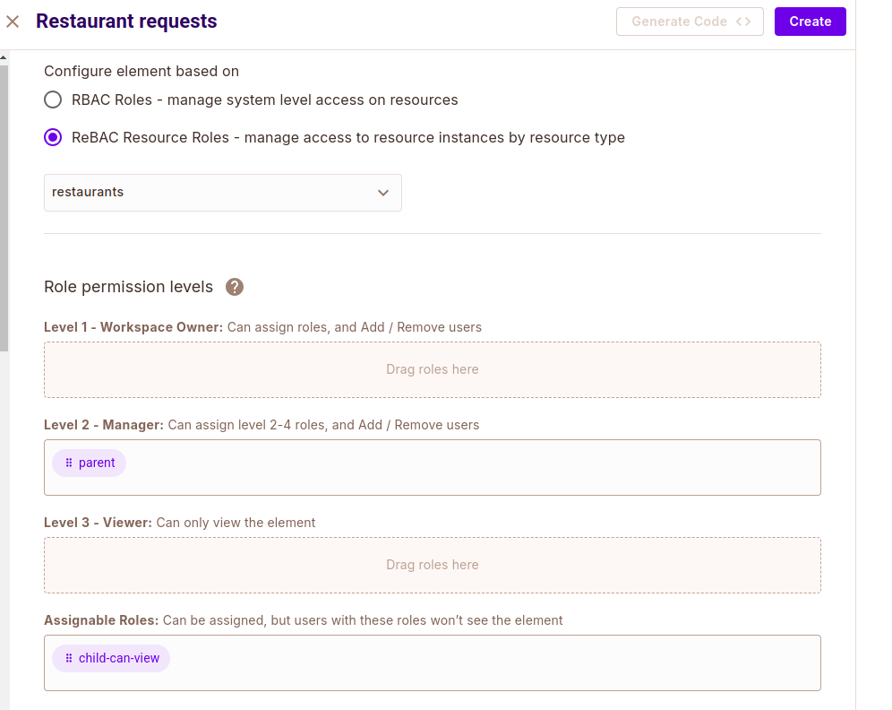
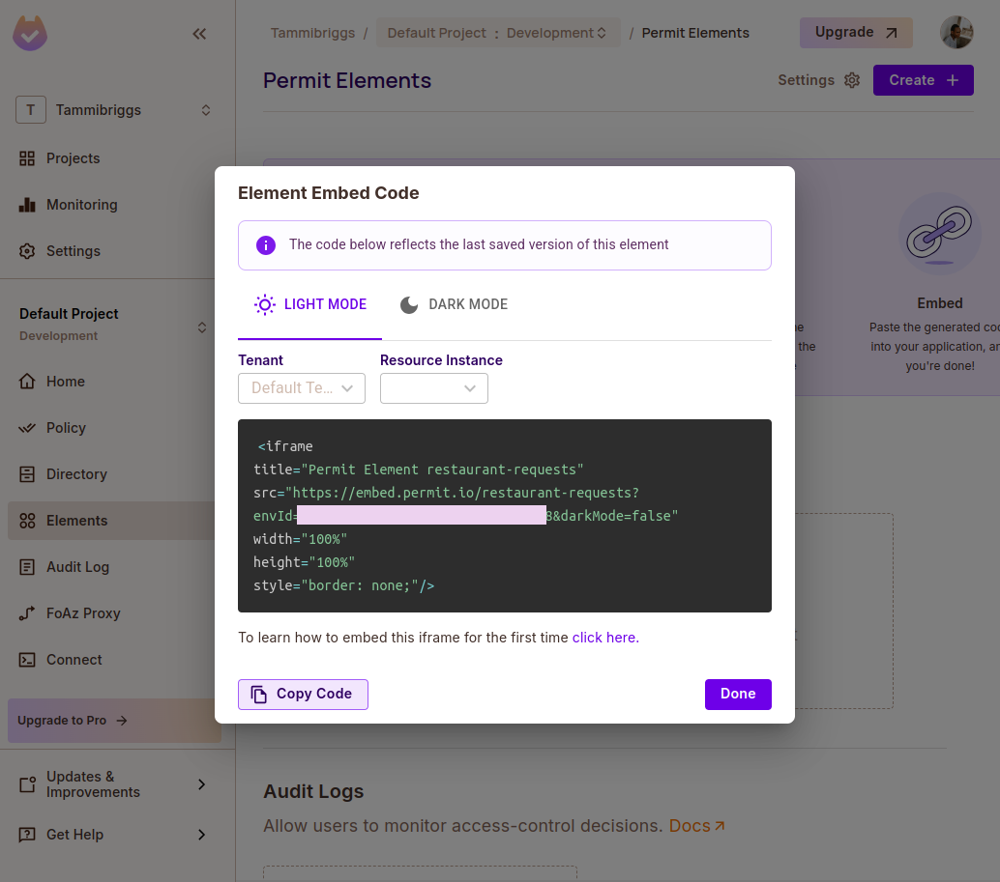

# Family Food Ordering System
This is a food ordering system built around the Permit MCP server, featuring a tailored implementation of some of its tools. It includes a Claude-powered MCP client that seamlessly connects to the food ordering server.

## Features
- Verify user access.
- List available restaurants and their dishes.
- Process dish orders with price restrictions for children.
- Request access to restaurants and dishes.
- List and approve pending restaurant access and restricted dish order requests.

## Prerequisite
- Python >= 3.10
- `uv` >= 0.6.1
- Running instance of [Permit PDP](https://docs.permit.io/how-to/deploy/deploy-to-production/#installing-the-pdp)
- An Anthropic API key from the [Anthropic Console](https://console.anthropic.com/settings/keys)

## Setting up the server
To setup the server you need supply the environment variables in defined in the `.env.example` file. Create a `.env` file in the root directory and specify the following variables: 

```shell
ANTHROPIC_API_KEY=
TENANT= # e.g default
LOCAL_PDP_URL= 
PERMIT_API_KEY=
PROJECT_ID=
ENV_ID=
ACCESS_ELEMENTS_CONFIG_ID=
OPERATION_ELEMENTS_CONFIG_ID=
```

You can use the following ressources to help with that: 
- [LOCAL_PDP_URL](https://docs.permit.io/how-to/deploy/deploy-to-production/#installing-the-pdp)
- [PERMIT_API_KEY](https://docs.permit.io/overview/use-the-permit-api-and-sdk#obtain-your-api-key)
- [PROJECT_ID](https://docs.permit.io/api/examples/get-project-and-env#get-project-id-or-key)
- [ENV_ID](https://docs.permit.io/api/examples/get-project-and-env#get-environment-id-or-key)

To get the ACCESS_ELEMENTS_CONFIG_ID and OPERATION_ELEMENTS_CONFIG_ID variables, we need to creat a User Management and Approval Management elements but before that let's create a resource named 'restaurants' as it's needed to configure the User Management element.

## Create a restaurants resource
In your Permit dashboard, navigate to Policy > Resources, then click on the **Create a Resource** button. Name the resource "restaurants" and add these two ReBAC roles: "parent", "child-can-order'. 


In the **Policy Editor** tab, give the added ReBAC roles the following permissions:


## Get the ACCESS_ELEMENTS_CONFIG_ID
Navigate to Elements in the sidebar and create a User Management element with the following values: 
  - Name: Restaurant Requests
  - Configure elements based on: ReBAC Resource Roles
  - Resource Type: restaurants
  - Role permission levels: 
    - Level 1 - Workspace Owner: parent
    - Assignable Roles: child-can-order



Click **Create**. Then click on **Get Code** in the new User Mananagment tab and you will see the element config ID (restaurant-requests).



Supply the element config to the environment variable.

## Get the OPERATION_ELEMENTS_CONFIG_ID
Create an Approval Management element named "Dish Requests" then get the element config ID (dish-approval) and supply it to the environment variable. 

You will also need to create a Operation Approval element which will make the _Reviewer_ and _Approved_ role avaialble. These roles will be ued to identify who can approve an operation request and which users has been approved. 

- Name: Dish Approval
- Resource Type: restaurants

## Runing the MCP Client
Enter the following command in your terminal:

```shell
uv pip install -e . # install dependencies
uv run client.py server.py # run the client
```

You can login with the following username: 
```python
[
  {"username": "joe", "role": "parent"},
  {"username": "jane", "role": "parent"},
  {"username": "henry", "role": "child"},
  {"username": "rose", "role": "child"}
]
```


